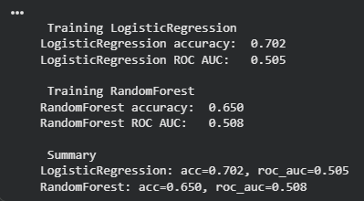
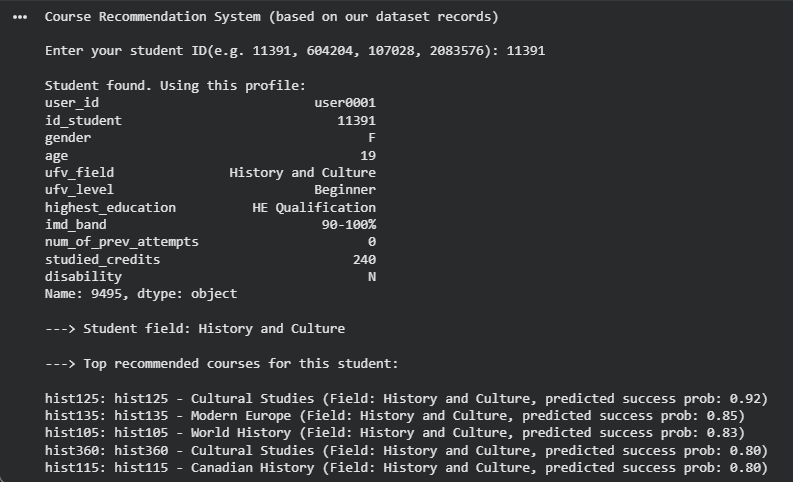

# Course Recommendation System | Python + Google Colab

## Overview
This project develops a machine learning-based recommendation system that predicts a student's probability of success across different courses and generates personalized course suggestions.

By leveraging student data, the system provides data-driven insights to support better academic decision-making.

---> **Try the Course Recommendation System here:** https://colab.research.google.com/drive/12sxb9zOFnwEWdDqvsath3BFS7QteA1Ca#scrollTo=sfPqrd-eUUBB

---

## Problem
Students often select courses without fully understanding which ones align with their academic background or likelihood of success. This can lead to poor performance, increased stress, and delayed graduation.

This project addresses this issue by using predictive modeling to recommend courses tailored to each student’s profile.

---

## Dataset
- Source: OULAD dataset (Kaggle)
- Cleaned and reduced for analysis
- 19,695 student records
- 80 unique courses
- Includes demographic and academic features (age, gender, attempts, credits, etc.)

---

## Methodology
The problem is formulated as a **binary classification task**:

- **1 → Successful (Pass / Distinction)**  
- **0 → Not Successful (Fail / Withdrawn)**  

### Workflow:
1. Data cleaning and preprocessing  
2. Feature engineering and encoding  
3. Train-test split  
4. Model training and evaluation:
   - Logistic Regression
   - Random Forest  
5. Model comparison using Accuracy and ROC-AUC  
6. Selection of best-performing model  

---

## Model Performance
| Model                | Accuracy | ROC-AUC |
|---------------------|---------|--------|
| Logistic Regression | 0.702   | 0.505  |
| Random Forest       | 0.650   | 0.508  |

Logistic Regression achieved better performance and was selected as the final model.

---

## Model Comparison Visualization

---

## How It Works
1. User inputs a student ID  
2. The system retrieves the student's profile  
3. Predicts success probability for all available courses  
4. Ranks courses from highest to lowest probability  
5. Prioritizes courses within the student’s academic field  

---

## Example Output
| Course Code | Course Name       | Predicted Success |
|------------|------------------|------------------|
| hist125    | Cultural Studies  | 0.92             |
| hist135    | Modern Europe     | 0.85             |
| hist105    | World History     | 0.83             |

---

## Example Output Visualization

---

## Key Insights
- Simpler models like Logistic Regression can outperform more complex models on structured datasets  
- Feature quality and preprocessing have a significant impact on model performance  
- Personalized recommendations can support more informed academic decisions  

---

## Tools & Technologies
- Python  
- Pandas  
- NumPy  
- Scikit-learn  
- Google Colab  

---

## Future Improvements
- Incorporate behavioral data (e.g., grades, engagement, activity logs)  
- Experiment with more advanced models (e.g., gradient boosting, neural networks)  
- Develop an interactive web interface for real-time recommendations  

---

## Conclusion
This project demonstrates how machine learning can be applied to a real-world problem in education. By predicting student success and generating personalized recommendations, the system provides a practical example of how data analysis can drive meaningful insights and decision-making.
